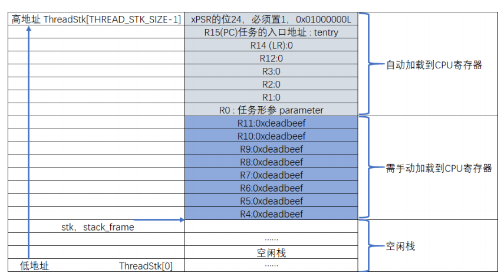
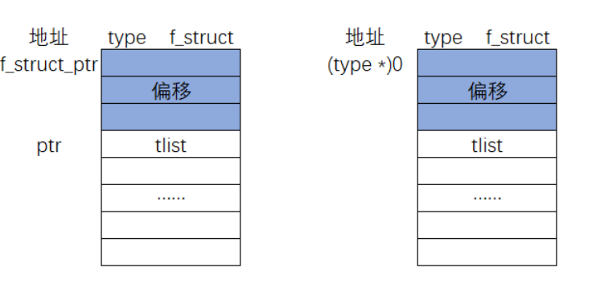

[TOC]


# 什么是线程

在多线程系统中，我们根据功能的不同，把整个系统分割成一个个独立的且无法返回的函数，这个函数我们称为线程。线程的大概形式：

```c
void thread_entry(void *parg)
{
/*线程主体，无限循环且不能返回*/
    for(;;)
    {
    /*线程主体代码*/
    }
}
```

# 创建线程

## 定义线程栈

在多线程系统中，每个线程都是独立的，互不干扰的，所以要为每个线程都分配独立的栈空间，这个栈空间通常是一个预先定义好的全局数组，也可以是动态分配的一段内存空间，但它们都存在于RAM中。

```c
ALIGN(RT_ALIGN_SIZE)
/*定义线程栈*/
rt_uint8_t rt_xxx_thread_stack[512];
```

在RT-Thread中，凡是涉及到数据类型的地方，RT-Thread都会将标准的C数据类型用typedef重新取一个类型名，以“rt”前缀开头.

## 定义线程函数

线程是一个独立的函数，函数主体无限循环且不能返回。

```c
/*线程2*/
void flag2_thread_entry(void* p_arg)
{
        for(;;)
        {
          
          /*线程切换，这里是手动切换*/
           rt_schedule();
        }
}
```

## 定义线程控制块(rtdef.h)

在多线程系统中，线程的执行是由系统调度的。系统为了顺利的调度线程，为每个线程都额外定义了一个线程控制块，这个线程控制块就相当于线程的身份证，里面存有线程的所有信息，比如线程的栈指针，线程名称，线程的形参等。有了这个线程控制块之后，以后系统对线程的全部操作都可以通过这个线程控制块来实现。

```C
structrt_thread
{
    void *sp;/*线程栈指针*/
    void *entry;/*线程入口地址*/
    void *parameter;/*线程形参*/
    void *stack_addr;/*线程起始地址*/
    rt_uint32_t stack_size;/*线程栈大小，单位为字节*/
    
    rt_list_t tlist;/*线程链表节点*/
};
typedef structrt_thread *rt_thread_t;
```

在RT-Thread中，都会给新声明的数据结构重新定义一个指针。往后如果要定义线程控制块变量就使用structrt_threadxxx的形式，定义线程控制块指针就使用rt_thread_txxx的形式。

## 实现线程创建函数(thread.c)

程的栈，线程的函数实体，线程的控制块最终需要联系起来才能由系统进行统一调度。那么这个联系的工作就由线程初始化函数**rt_thread_init()**来实现。

**遵循RT-Thread中的函数命名规则，以小写的rt开头，表示这是一个外部函数，可以由用户调用，以_rt开头的函数表示内部函数，只能由RT-Thread内部使用。紧接着是文件名，表示该函数放在哪个文件，最后是函数功能名称。**

### 实现链表相关函数

初始化线程链表节点，往后我们要把线程插入到各种链表中，就是通过这个节点来实现的，它就好像是线程控制块里面的一个钩子，可以把线程控制块挂在各种链表中。在初始化之前我们需要在线程控制块中添加一个线程链表节点

#### 定义链表节点数据类型

```c
struct rt_list_node
{
  structrt_list_node *next;/*指向后一个节点*/
  structrt_list_node *prev;/*指向前一个节点*/
  };
typedef structrt_list_node rt_list_t;
```

#### 初始化链表节点

```c
rt_inline void rt_list_init(rt_list_t *l)
{
	l->next=l->prev=l;
}
```

#### 在双向链表表头后面插入一个节点

```c
/*在双向链表头部插入一个节点*/
rt_inline void rt_list_insert_after(rt_list_t *l,rt_list_t *n)
{
    l->next->prev=n;/*第1步*/
    n->next=l->next;/*第2步*/
    l->next=n;/*第3步*/
    n->prev=l;/*第4步*/
}
```

#### 在双向链表表头前面插入一个节点

```c
rt_inline void rt_list_insert_before(rt_list_t*l,rt_list_t*n)
{
  l->prev->next=n;/*第1步*/
  n->prev=l->prev;/*第2步*/
  l->prev=n;/*第3步*/
  n->next=l;/*第4步*/
}
```

#### 从双向链表删除一个节点

```c
rt_inlinevoidrt_list_remove(rt_list_t*n)
{
  n->next->prev=n->prev;/*第1步*/
  n->prev->next=n->next;/*第2步*/
  n->next=n->prev=n;/*第3步*/
}
```

### rt_hw_stack_init()函数

初始化线程栈，并返回线程栈顶指针。rt_hw_stack_init()用来初始化线程栈，当线程第一次运行的时候，加载到CPU寄存器的参数就放在线程栈里面，该函数在cpuport.c中实现

线程第一次运行的时候，加载到CPU寄存器的环境参数我们要预先初始化好。从栈顶开始，初始化的顺序固定，首先是异常发生时自动保存的8个寄存器，即xPSR、R15、R14、R12、R3、R2、R1和R0。其中xPSR寄存器的位24必须是1，R15PC指针必须存的是线程的入口地址，R0必须是线程形参，剩下的R14、R12、R3、R2和R1我们初始化为0。



## 实现就绪列表(scheduler.c)

### 定义就绪列表

线程创建好之后，我们需要把线程添加到就绪列表里面，表示线程已经就绪，系统随时可以调度。

```c
/*线程就绪列表*/
rt_list_t rt_thread_priority_table[RT_THREAD_PRIORITY_MAX];
```

就绪列表实际上就是一个rt_list_t类型的数组，数组的大小由决定最大线程优先级的宏RT_THREAD_PRIORITY_MAX决定，RT_THREAD_PRIORITY_MAX在**rtconfig.h**中默认定义为32。数组的下标对应了线程的优先级，同一优先级的线程统一插入到就绪列表的同一条链表中。

### 将线程插入到就绪列表

我们将线程插入到就绪列表里面，就是通过将线程控制块的tlist这个节点插入到就绪列表中来实现的。

```c
/*初始化线程*/
rt_thread_init(&rt_flag1_thread,/*线程控制块*/
                xxx_thread_entry,/*线程入口地址*/
                RT_NULL,/*线程形参*/
                &rt_xxx_thread_stack[0],/*线程栈起始地址*/
                sizeof(rt_xxx_thread_stack));/*线程栈大小，单位为字节*/
/*将线程插入到就绪列表*/
rt_list_insert_before(&(rt_thread_priority_table[0]),&(rt_xxx_thread.tlist));
```

## 实现调度器

### 调度器初始化

调度器在使用之前必须先初始化

初始化线程就绪列表，初始化完后，整个就绪列表为空

```c
/*初始化系统调度器*/
void rt_system_scheduler_init(void)
```

### 启动调度器

调度器启动由函数**rt_system_scheduler_start()**来完成。

调度器在启动的时候会从就绪列表中取出优先级最高的线程的线程控制块，然后切换到该线程。



知道了一个节点tlist的地址ptr，现在要推算出该节点所在的type类型的结构体的起始地址f_struct_ptr。我们可以将ptr的值减去图中灰色部分的偏移的大小就可以得到f_struct_ptr的地址，现在的关键是如何计算出灰色部分的偏移大小。这里采取的做法是将0地址强制类型类型转换为type，即**(type*)0**，然后通过指针访问结构体成员的方式获取到偏移的大小，即**(&((type*)0)->member)**，最后即可算出f_struct_ptr=ptr-(&((type*)0)->member)。

### 第一次线程切换

#### rt_hw_context_switch_to()函数（context_rvds.s）

用于实现第一次线程切换。当一个汇编函数在C文件中调用的时候，如果有一个形参，则执行的时候会将这个形参传入到CPU寄存器r0，如果有两个形参，第二个则传入到r1。

#### PendSV_Handler()函数

PendSV_Handler()函数是真正实现线程上下文切换的地方

### 系统调度

系统调度就是在就绪列表中寻找优先级最高的就绪线程，然后去执行该线程。

#### rt_schedule()函数

系统调度函数。

#### rt_hw_contex_switch()函数

产生上下文切换。

## main()(手动切换线程)

```c
/*
*************************************************************************
*                             包含的头文件
*************************************************************************
*/

#include <rtthread.h>
#include "ARMCM4.h"


extern rt_list_t rt_thread_priority_table[RT_THREAD_PRIORITY_MAX];

/*
*************************************************************************
*                      线程控制块 & STACK & 线程声明
*************************************************************************
*/


/* 定义线程控制块 */
struct rt_thread rt_xxx_thread;
struct rt_thread rt_xxxx_thread;

ALIGN(RT_ALIGN_SIZE)
/* 定义线程栈 */
rt_uint8_t rt_xxx_thread_stack[512];
rt_uint8_t rt_xxxx_thread_stack[512];

/* 线程声明 */
void xxx_thread_entry(void *p_arg);
void xxxx_thread_entry(void *p_arg);

/************************************************************************
  * @brief  main函数
  * @param  无
  * @retval 无
  *
  * @attention
  *********************************************************************** 
  */
int main(void)
{	
	/* 硬件初始化 */
	/* 将硬件相关的初始化放在这里，如果是软件仿真则没有相关初始化代码 */	
	
	/* 调度器初始化 */
	rt_system_scheduler_init();
	
	
	/* 初始化线程 */
	rt_thread_init( &rt_xxx_thread,                 /* 线程控制块 */
	                xxx_thread_entry,               /* 线程入口地址 */
	                RT_NULL,                          /* 线程形参 */
	                &rt_xxx_thread_stack[0],        /* 线程栈起始地址 */
	                sizeof(rt_xxx_thread_stack) );  /* 线程栈大小，单位为字节 */
	/* 将线程插入到就绪列表 */
	rt_list_insert_before( &(rt_thread_priority_table[0]),&(rt_xxx_thread.tlist) );
	
	/* 初始化线程 */
	rt_thread_init( &rt_xxxx_thread,                 /* 线程控制块 */
	                xxxx_thread_entry,               /* 线程入口地址 */
	                RT_NULL,                          /* 线程形参 */
	                &rt_xxxx_thread_stack[0],        /* 线程栈起始地址 */
	                sizeof(rt_xxxx_thread_stack) );  /* 线程栈大小，单位为字节 */
	/* 将线程插入到就绪列表 */
	rt_list_insert_before( &(rt_thread_priority_table[1]),&(rt_xxxx_thread.tlist) );
	
	/* 启动系统调度器 */
	rt_system_scheduler_start(); 
}

/*
*************************************************************************
*                               函数实现
*************************************************************************
*/

/* 线程1 */
void xxx_thread_entry( void *p_arg )
{
	for( ;; )
	{
		
		
		/* 线程切换，这里是手动切换 */		
		rt_schedule();
	}
}

/* 线程2 */
void xxxx_thread_entry( void *p_arg )
{
	for( ;; )
	{
	
		/* 线程切换，这里是手动切换 */
		rt_schedule();
	}
}

```

