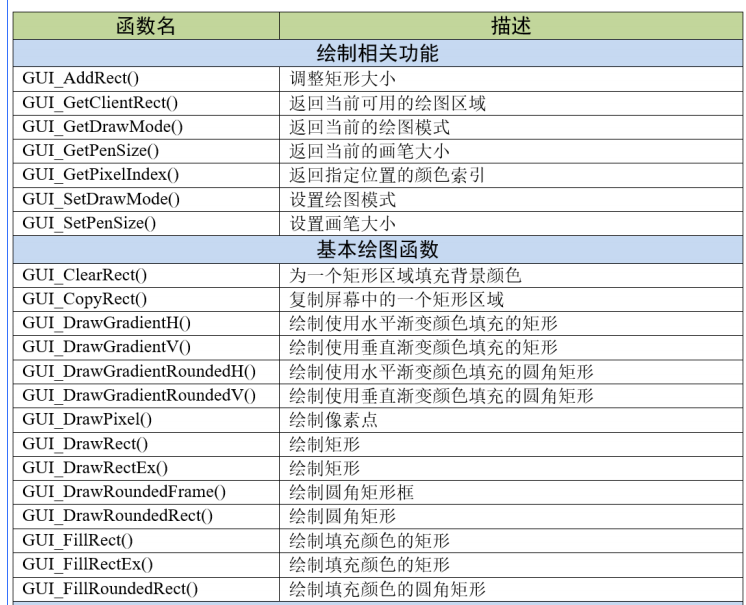
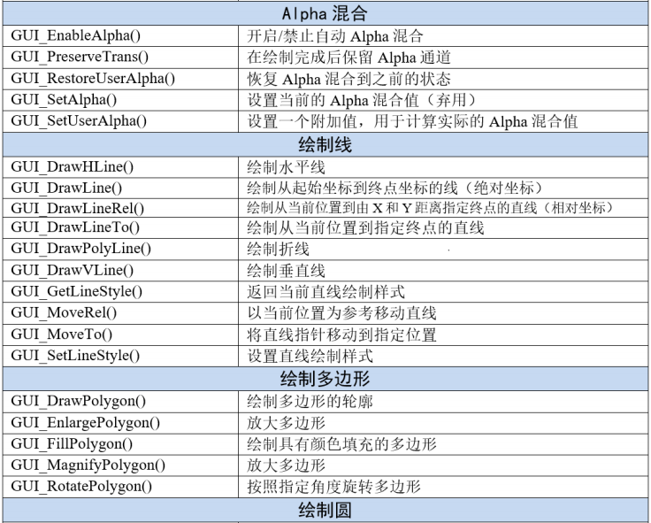
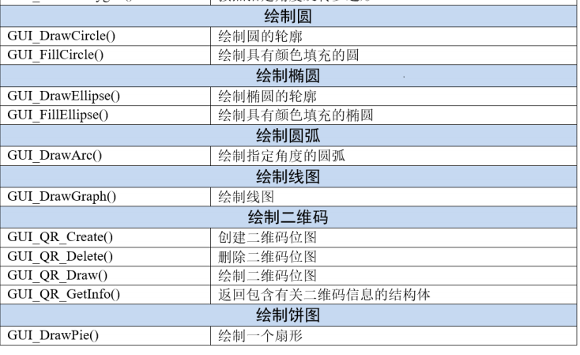

[TOC]


# 2D绘图API函数








# 基本绘图

## GUI_SetLineStyle()

```c
U8	GUI_SetLineStyle(U8 LineStyle);
```


**LinStyle**：新的直线样式。可用的参数有：

**GUI_LS_SOLID**：直线将绘制为视线（默认）；

**GUI_LS_DASH**：直线将被绘制为虚线；

**GUI_LS_DOT**：直线将被绘制为点线；

**GUI_LS_DASHDOT**：线条将绘制成一个破折号和一个点交替的形式；

**GUI_LS_DASHDOTDOT**：线条将绘制成破折号和双点交替的形式。


## GUI_DrawLine()

从指定起点绘制一条线到当前窗口中的指定终结点(绝对坐标)。

```c
void GUI_DrawLine(int x0,int y0,int x1,int y1);
```


1)x0：起始位置的X轴坐标；

2)y0：起始位置的Y轴坐标；

3)x1：终点位置的X轴坐标；

4)y1：终点位置的Y轴坐标。


# GUI_DrawRect()

在当前窗口中的指定位置绘制矩形。

```C
void GUI_DrawRect(int x0,int y0,int x1,int y1);
```

5)x0：矩形右上角的X轴坐标；

6)y0：矩形右上角的Y轴坐标；

7)x1：矩形左下角的X轴坐标；

8)y1：矩形左下角的Y轴坐标。

# GUI_FillRect()

在当前窗口中的指定位置绘制带填充的矩形。

```c
void GUI_FillRect(int x0,int y0,int x1,int y1);
```

同上

# 绘制二维码

## GUI_QR_Create()

```c
GUI_HMEM GUI_QR_Create(const char* pText,int PixelSize,int EccLevel,int Version);
```

1)pText：需要制作成二维码的UTF-8编码的文本；

2)PixelSize：单个数据色块的大小(以像素为单位)；

3)EccLevel：要使用的纠错编码等级，可选的纠错编码等级如下：

**GUI_QR_ECLEVEL_L**：可以恢复7%的数据；

**GUI_QR_ECLEVEL_M**：可以恢复15%的数据；

**GUI_QR_ECLEVEL_Q**：可以恢复25%的数据；

**GUI_QR_ECLEVEL_H**：可以恢复30%的数据。

4)Version：二维码版本号，用于规定生成的二维码的尺寸。如果设置为0（推荐），将自动计算大小。必须介于1和40之间。如果它小于给定文本与给定EccLevel所需的值，则该函数将失败。返回值：成功时返回位图的句柄，出错时返回0。

## GUI_QR_Delete()

```c
void GUI_QR_Delete(GUI_HMEM hQR);
```

1)hQR：需要删除的二维码句柄。如果不再使用二维码，则应将其删除，以免出现某些未知错误。

## GUI_QR_Draw()

```c
void GUI_QR_Draw(GUI_HMEM hQR,int xPos,int yPos);
```

1)hQR：需要显示的二维码句柄；

2)xPos：需要显示位置的x轴坐标；

3)yPos：需要显示位置的y轴坐标。

## GUI_QR_GetInfo()

返回包含有关指定二维码代码信息的结构体。

```c
void GUI_QR_GetInfo(GUI_HMEM hQR,GUI_QR_INFO *pInfo);
```

1)hQR：二维码句柄；

2)pInfo：指向GUI_QR_INFO类型的结构体指针。

```c
typedefstruct{
int Version;//二维码的版本号
int Width;//数据色块的个数
int Size;//位图的大小(以像素为单位)
}GUI_QR_INFO;
```

