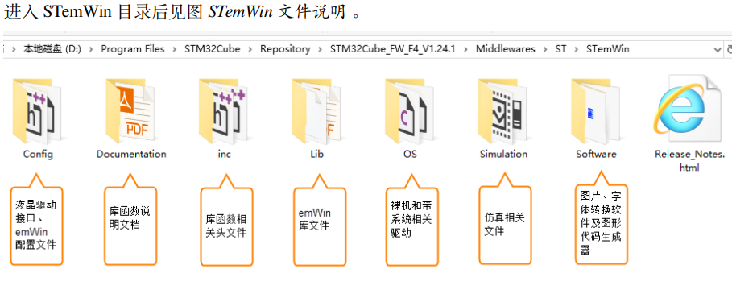
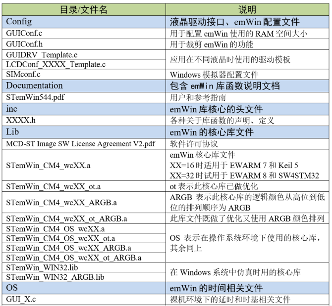
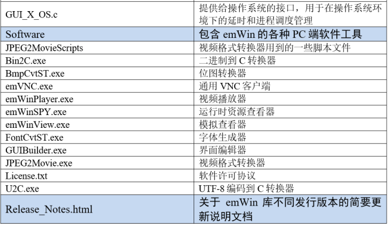
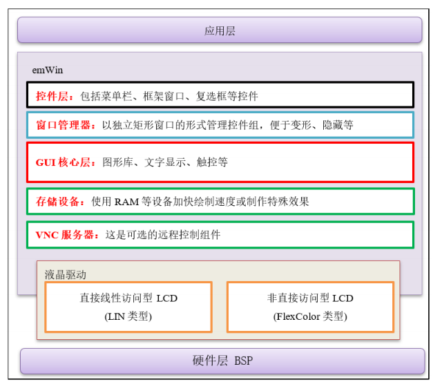

[TOC]

# 3.2emWin目录结构

**•Config文件夹：**其中的GUIConf.c文件用于配置emWin的存储空间分配，GUIConf.h文件用于裁剪emWin的功能。其余的GUIDRV_Template.c、LCDConf_FlexColor.c、GUIDRV_wf.c是emWin应用在不同液晶时使用的不同驱动模板；

**•Documentation文件夹：**它包含了《STemWin544.pdf》文件，是关于emWin库的用户手册，由于emWin库不是开源代码，所以在使用emWin的函数接口时，唯一可以参考的说明就是这个手册；

**•inc文件夹：**它包含了全部的emWin库核心的头文件，各种关于库函数的声明、定义都在这些文件里面；

**•Lib文件夹：**它包含了emWin的代码库文件，针对Cortex-M0、M3和M4这些不同CPU内核以及是否优化，都有一个相对应的emWin库，在使用的时候我们要根据自己的平台选择合适的库文件；

**•OS文件夹：**它包含了GUI_X.c及GUI_X_FreeRTOS.c文件，分别是对应裸机平台的GUI延时，和多任务系统平台的关于进程调度之类的一些emWin所需要的底层接口；

**•Simulation文件夹：**它包含了用于PC端仿真时的lib库和一些依赖，但是不包含PC端仿真的完整工程。

**•Software文件夹：**它包含了BmpCvt.exe、GUIBuilder.exe和FontCvt.exe等PC端软件工具。BmpCvt.exe用于把图片数据转换成C文件，GUIBuilder.exe是一个使用图形界面方式开发emWin应用的工具(有点像Qt的图形开发方式)，而FontCvt.exe则用于字体文件转换；•Release_Notes.html文件：是关于emWin库不同发行版本的简要更新说明文档。

# 3.3emWin文件说明

# emWin应用的软件架构

从这个架构图可以看出，只需要编写好液晶驱动这个粘合emWin库和硬件BSP层的中间件，就可以正常使用emWin了，迁移应用到不同的平台也简单得多。