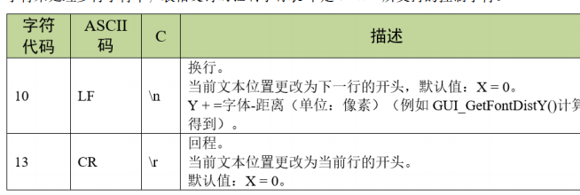
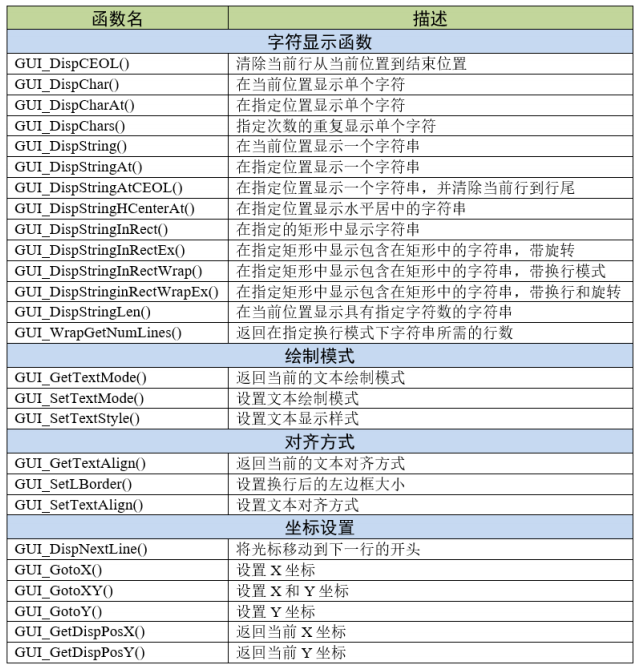
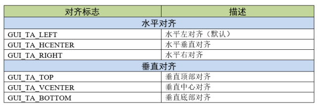
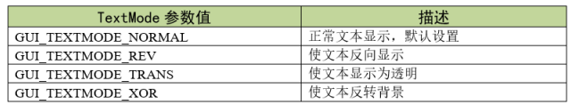
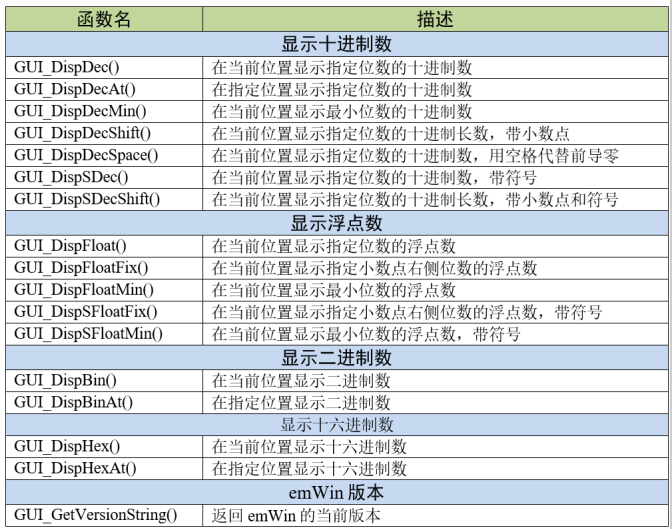

[TOC]

# 简单文本显示

在emWin中我们任然可以使用控制字符来处理多行字符串，表格支持的控制字符表中是emWin所支持的控制字符。

# 文本显示API

# 重要函数

## GUI_DispCEOL()

将当前窗口（或显示）中的当前行从当前文本位置清除到窗口末尾，行高度为当前字体的高度。

## GUI_DispStringInRectWrap()

在当前窗口中，使用当前字体在指定矩形内的指定位置显示字符串，并可选择换行模式。

**TextAlign**：对齐标志。可使用“或”操作进行组合。水平对齐标志和垂直对齐标志应该组合使用。可用的标志见表格对齐标志：

**WrapMode**：换行模式。有三种换行模式，分别是：

**GUI_WRAPMODE_NONE**：不执行自动换行；

**GUI_WRAPMODE_WORD**：按照字对齐，对文本进行自动换行；

**GUI_WRAPMODE_CHAR**：按照字符对齐，对文本进行自动换行。

## GUI_SetTextMode()

按照指定的参数设置文本绘制模式。

1)TextMode：要设置的文本模式。可以是TEXTMODE标志的任意组合。参数TextMode允许的值见表格TextMode参数值；

这些参数值可通过“或”操作进行组合使用，例如透明反转文本就是通过参数GUI_TM_TRANS|GUI_TM_REV设置的，此绘制模式是透明文本和反转文本的组合，与透明文本一样，它不会覆盖背景，而且和反转文本一样，该文本会反转显示。

## GUI_SetTextAlign()

为当前窗口中的字符串显示设置文本对齐方式。

TextAlign：要设置的文本对齐方式。允许的值如下，可使用“或”操作进行组合：

水平对齐方式：**GUI_TA_LEFT**、**GUI_TA_HCENTER**、**GUI_TA_RIGHT**

垂直对齐方式：**GUI_TA_TOP**、**GUI_TA_VCENTER**、**GUI_TA_BOTTOM**

# 文本显示实验

想要在STM32上使用emWin就必须在GUI初始化之前开启CRC时钟，不然emWin将无法使用。但**CRC时钟**与emWin本身并没有什么联系，这只是ST为STemWin做的一个保护，这样STemWin就只能在ST的芯片上运行。

**GUI_Init()**函数主要是初始化emWin内部的数据结构和变量，在使用几乎所有的emWin功能之前都必须首先调用此函数。**WM_MULTIBUF_Enable()**函数是开启自动使用多帧缓冲功能，此功能可以有效的缓解控件移动或某些绘图操作产生的画面撕裂，并可在一定程度上提升系统流畅度。开启使用多帧缓冲后，emWin的窗口管理器会将所有绘图函数的输出重定向到不可见的后台缓冲区，然后再绘制无效的窗口，绘制完最后一个无效窗口后，窗口管理器使后台缓冲区可见。不过此功能仅当显示驱动程序支持多个缓冲区且内存足以存储至少2个帧缓冲区时才可用。

调用**GUI_SetBkColor()**后并不会更新桌面的背景颜色，需要在这之后调用**GUI_Clear()**才会更新。

**GUI_DispStringHCenterAt()**函数的功能是在指定位置显示水平居中的字符串，该函数的坐标参数是字符串的居中点坐标，而不是起始坐标。

# 数值显示

emWin支持十进制、浮点数、十六进制和二进制的数值显示。虽然我们可以用C库中的sprintf函数将数值转换成字符串，但是emWin的数值显示API可以节省部分内存空间和运行时间。

## 数值显示API

