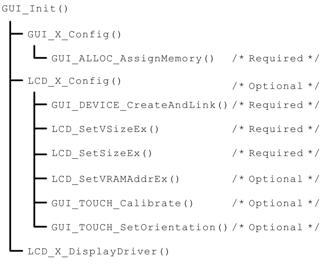
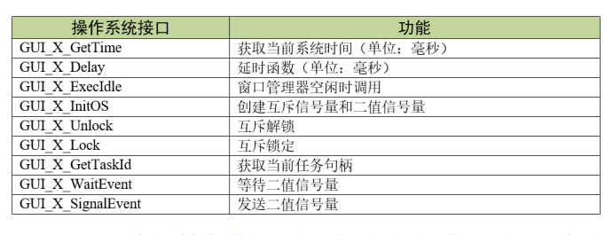
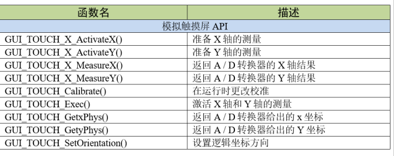

[TOC]

# emWin的初始化

​	在这个GUI_Init函数里，调用了emWin底层的配置函数，见下图emWin初始化流程。它按顺序分别调用了GUI_X_Config、LCD_X_Config及LCD_X_DisplayDriver函数，完成了存储器分配、屏幕类型配置及初始化液晶驱动的工作。

# 移植emWin所需要的配置：

## •配置系统功能（GUIConf.h）；

(1)GUI_NUM_LAYERS设置了emWin最大支持的显示图层数。其实GUIConf.h文件中的此参数是无效的，对于8080并口的开发板，由于芯片本身性能的限制不能很好的支持多图层显示；对于RGB接口的开发板，在配置显示驱动接口的时候会对这个宏进行重定义，真正起作用的是重定义之后的宏；

(2)GUI_OS定义了是否支持操作系统和多任务功能，为1时支持，可通过OS_SUPPORT宏来设置，在教程配套的例程中我们将OS_SUPPORT宏定义放在了MDK的预编译选项中，见图OS_SUPPORT宏的定义位置；

(3)GUI_SUPPORT_TOUCH设置是否支持触摸操作，为1时支持；

(4)GUI_DEFAULT_FONT设置默认字体大小，这个宏一般不会修改；

(5)GUI_SUPPORT_MOUSE设置是否启用鼠标；

(6)GUI_WINSUPPORT设置是否使用窗口管理器；

(7)GUI_SUPPORT_MEMDEV设置是否使用内存设备；

(8)GUI_SUPPORT_DEVICES设置是否使用设备指针；

(9)USE_EXTMEMHEAP是自行添加的宏，设置是否使用外部SDRAM作为emWin的内存堆，为1时使用外部SDRAM，为0时使用内部RAM，作用于GUIConf.c文件；

(10)GUI_USE_ARGB设置emWin运行时的逻辑颜色格式，虽然emWinV5.30以后支持ARGB颜色格式，但默认格式仍然是ABGR，所以需要使用该宏进行切换。对于野火F1系列开发板，只要使用名字带ARGB的emwin库即可，此宏不用设置。

## •配置操作系统接口（GUI_X_FreeRTOS.c）；

封装的操作系统接口总结如下表需要提供给emWin的操作系统接口所示，主要包括互斥信号量和二值信号量的创建、获取和释放的操作，还包含有获取任务句柄、当前系统时间戳以及延时相关的操作。

## •配置内存管理接口（GUIConf.c）；

8080并口和RGB接口的这一步的移植步骤就不一样了。

emWin启动时，**GUI_X_Config**函数是**GUI_Init**调用的第一个初始化函数，这个函数初始化了emWin的运行内存。

用户可通过**GUI_NUMBYTES**改变emWin使用的内存块大小，在本示例中的1024KB。也可通过GUIConf.h中的**USE_EXTMEMHEAP**宏来选择emWin的内存堆是在内部RAM还是外部SRAM。请注意，应用程序无法使用全部的内存空间，因为emWin的内存管理系统本身使用了其中很小的一部分，大约12个字节用于系统管理。

## •配置显示驱动接口（LCDConf_FlexColor.c）；

emWin的显示驱动接口主要包括在LCDConf_FlexColor.c文件中，移植时主要针对LCDConf_FlexColor.c文件进行修改，同时也是emWin移植的重点对象。

**LCD_X_Config**函数的作用是创建一个显示驱动器件，设置颜色转换程序，并配置物理显示尺寸。

## •配置触摸屏接口。

emWin并没有将触摸设备接口整理为单独的.c文件，不过提供了触摸相关的库函数，用户需自行编写触摸接口。emWin针对电阻屏提供了专门的库函数，见表触摸设备API。

emWin把触摸设备、外接鼠标和指点杆等都归为指针输入设备(Pointerinputdevices或PID)这一大类中。其中触摸设备API分为通用触摸屏和模拟触摸屏两种，模拟触摸屏API为电阻屏专用。

